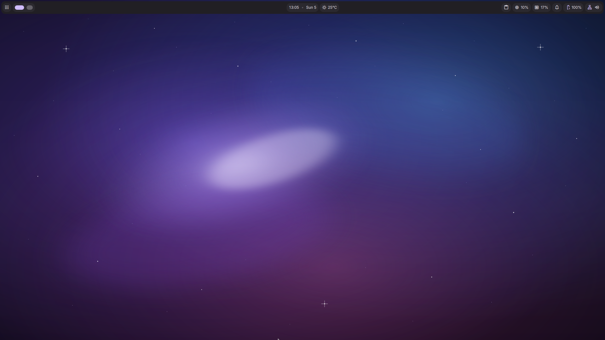
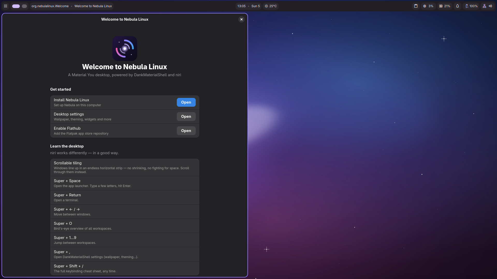
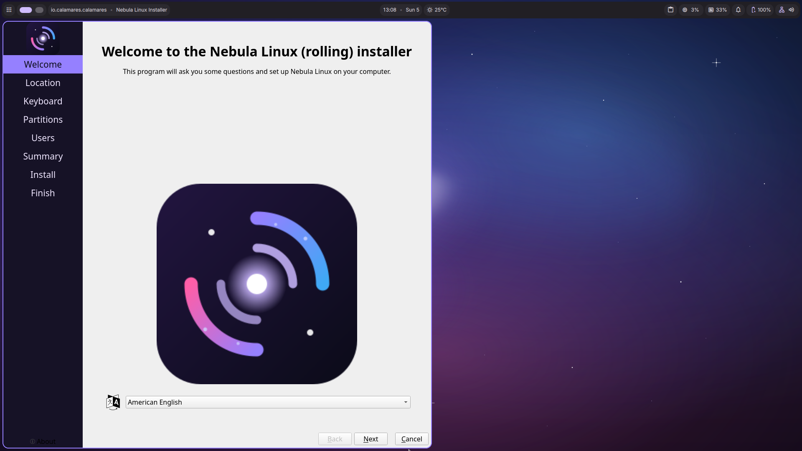
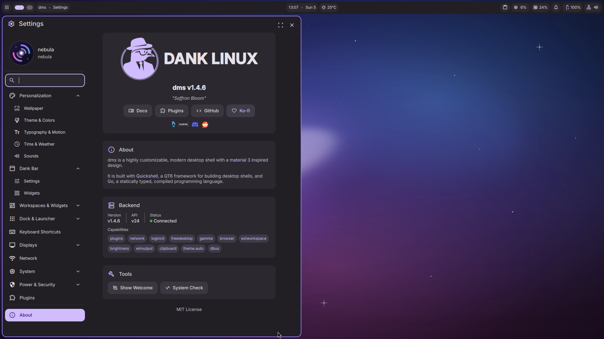
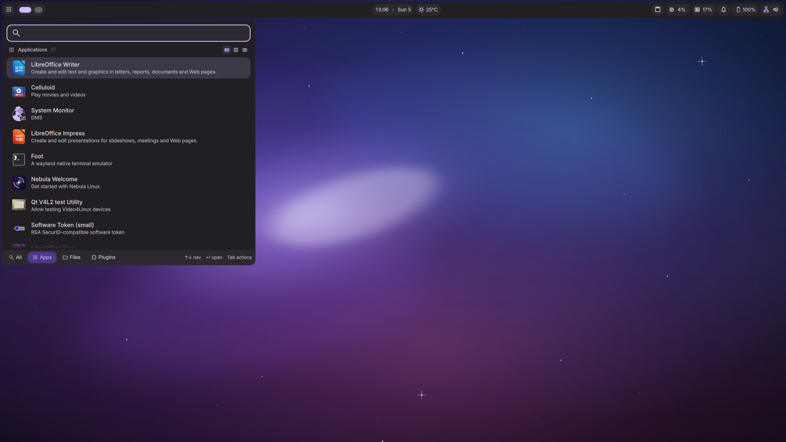
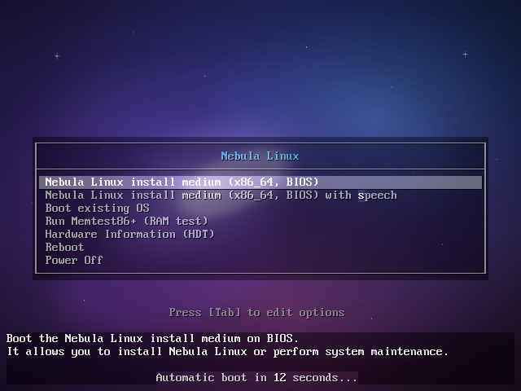

# Nebula Linux

An Arch-based Linux distribution featuring the **Dank Linux** UI —
[DankMaterialShell](https://github.com/AvengeMedia/DankMaterialShell) (Material 3
desktop shell built on Quickshell) running on the **niri** scrollable-tiling
Wayland compositor.

```
 ███╗   ██╗███████╗██████╗ ██╗   ██╗██╗      █████╗
 ████╗  ██║██╔════╝██╔══██╗██║   ██║██║     ██╔══██╗
 ██╔██╗ ██║█████╗  ██████╔╝██║   ██║██║     ███████║
 ██║╚██╗██║██╔══╝  ██╔══██╗██║   ██║██║     ██╔══██║
 ██║ ╚████║███████╗██████╔╝╚██████╔╝███████╗██║  ██║
 ╚═╝  ╚═══╝╚══════╝╚═════╝  ╚═════╝ ╚══════╝╚═╝  ╚═╝
              L  I  N  U  X
```

## Download

**[⬇ Download the ISO from SourceForge](https://sourceforge.net/projects/nebula-linux-arch-edition-niri/files/nebula-linux-2026.07.06-x86_64.iso/download)** (~2.2 GB)

`SHA256: ae7df8c707ec608c08fb8438d2f7847a07ebedf627a881baed7dafd247723b3a`

Flash it with [Rufus](https://rufus.ie) or [BalenaEtcher](https://etcher.balena.io), or boot it
in a VM (4+ GB RAM). Or [build it yourself](#building-the-iso).

## Screenshots

| | |
|---|---|
|  |  |
| The live desktop — DMS bar on niri | Nebula Welcome onboarding |
|  |  |
| Branded Calamares installer | DankMaterialShell settings |
|  |  |
| Apps on the scrollable-tiling desktop | Boot menu with nebula background |

## What you get

- **Live ISO** that boots straight into a full Dank Material Shell desktop
  (niri + DMS) as user `nebula` — no login required.
- **Nebula branding everywhere**: os-release, hostname, boot menus + BIOS boot
  splash, MOTD, TTY login prompt, logo (hicolor icons + pixmaps, shown in DMS
  Settings → About), default wallpaper (also the lock screen background, and
  matugen derives the whole Material color scheme from it), lock-screen user
  avatar, fastfetch ASCII logo, installer banner. The installer also rebrands
  the target's bootloader (systemd-boot entries / `GRUB_DISTRIBUTOR`).
- **Installer**: launch **"Install Nebula Linux"** from the app launcher
  (Super+Space) — a fully Nebula-branded **Calamares** GUI that installs by
  copying the live system, then strips the live-only pieces and sets up GRUB
  with the nebula background. (Calamares is built from the AUR during the ISO
  build and cached in `out\pkgcache\`.) A CLI fallback, `nebula-install`
  (archinstall wrapper), is also on the ISO.

## Desktop stack

| Component     | Package(s)                                          |
| ------------- | --------------------------------------------------- |
| Shell / UI    | `dms-shell-niri` (DankMaterialShell from Arch extra) |
| Compositor    | `niri` + `xwayland-satellite`                        |
| Login         | `greetd` (autologin in live session)                 |
| Audio         | PipeWire + WirePlumber                               |
| Network       | NetworkManager, bluez                                |
| Terminal      | `foot` (CPU-rendered — works in VMs)                 |
| Apps          | Firefox, Nautilus, LibreOffice, Celluloid (video), Loupe, Evince, File Roller, Calculator, Text Editor |
| Theming       | `matugen` (wallpaper-based Material colors) + adw-gtk3-dark, Papirus icons, qt6ct |
| Installer     | Calamares (Nebula-branded, AUR-built at ISO build time) |
| Snapshots     | btrfs by default + snapper + snap-pac + grub-btrfs (boot old snapshots from GRUB) |
| Login         | DMS graphical greeter on installed systems (`nebula greeter <dms\|text>` to switch) |
| Onboarding    | Nebula Welcome app (install, niri tour, app bundles, Flathub) |
| Control       | `nebula` CLI: update / snapshots / rollback / drivers / doctor / windows |
| Window modes  | scrollable tiling by default; `nebula windows floating` for classic windows (also a switch in Nebula Welcome) |
| VM support    | guest tools auto-start under QEMU/KVM, VirtualBox, VMware |
| Performance   | zram swap (zstd), fstrim timer |

## Building the ISO

`mkarchiso` only runs on Arch Linux, so the build happens inside a Docker
container. You need **Docker Desktop** (WSL2 backend) with ~15 GB free space.

```powershell
.\build.ps1
```

The first build downloads several GB of packages (a named Docker volume
`nebula-pacman-cache` caches them for subsequent builds). The finished ISO
lands in `out\nebula-linux-YYYY.MM.DD-x86_64.iso`.

Test it in a VM (Hyper-V, VirtualBox, VMware, or QEMU). Give it **4+ GB RAM**
and enable **EFI** if available. Boot, and the DMS desktop appears
automatically.

### Handy keys in the live session

| Key                | Action                        |
| ------------------ | ----------------------------- |
| `Super+Space`      | App launcher (Spotlight)      |
| `Super+Return`     | Terminal (foot)               |
| `Super+O`          | Overview                      |
| `Super+Q`          | Close window                  |
| `Super+,`          | DMS settings                  |
| `Super+Escape`     | Lock screen                   |
| `Super+Shift+/`    | Show all keybindings          |

## How the build works

1. `build.ps1` starts an `archlinux:latest` privileged container with this
   repo mounted read-only at `/src` and `out\` at `/out`.
2. `build.sh` (inside the container) installs `archiso`, copies the official
   **releng** profile, then:
   - overlays everything under [profile/airootfs/](profile/airootfs/) onto it,
   - appends [profile/packages-extra.x86_64](profile/packages-extra.x86_64) to the package list,
   - rebrands `profiledef.sh`, GRUB/syslinux boot menus (`Arch Linux` → `Nebula Linux`),
   - a [pacman hook](profile/airootfs/etc/pacman.d/hooks/zz-nebula-branding.hook)
     overwrites `/usr/lib/os-release` with [Nebula branding](profile/airootfs/usr/share/nebula/os-release)
     during pacstrap (and again on every future `filesystem` package upgrade),
   - swaps releng's iwd/systemd-networkd for NetworkManager, removes the
     root tty autologin, enables `greetd` + graphical target,
   - renders the wallpaper SVG to PNG,
   - runs `mkarchiso`.
3. The live ISO creates the `nebula` user at boot
   ([nebula-live-setup](profile/airootfs/usr/local/bin/nebula-live-setup)) and
   greetd autologs it into `niri-session`; niri spawns `dms run`.

## Repo layout

```
build.ps1                        Windows entry point (Docker)
build.sh                         Container-side build script
profile/
  packages-extra.x86_64          Desktop packages appended to releng list
  airootfs/                      Files overlaid into the live filesystem
    etc/greetd/config.toml       Autologin session config
    etc/skel/.config/niri/       niri config (spawns DMS, keybinds)
    etc/systemd/system/          nebula-live-setup.service
    usr/lib/os-release           Nebula branding
    usr/local/bin/nebula-install     Installer wrapper (archinstall + nebulaize)
    usr/local/bin/nebula-live-setup  Live user creation
    usr/share/backgrounds/nebula/    Wallpaper (SVG, rendered at build time)
```

## Roadmap

- [x] Calamares graphical installer (AUR build + local pacman repo on the ISO)
- [x] DankGreeter graphical login for installed systems (shipped inside `dms-shell`)
- [x] Snapshot rollback stack (btrfs + snapper + snap-pac + grub-btrfs)
- [x] Nebula Welcome onboarding app + niri tour
- [x] `nebula` control-center CLI
- [ ] `nebula-release` / `nebula-branding` pacman packages + own package repo
- [ ] Plymouth boot splash, GRUB theme for installed systems
- [ ] Custom Material icon theme & default DMS settings preset
- [ ] Hyprland edition (`dms-shell-hyprland`)
- [ ] Weekly auto-built ISOs (GitHub Actions) + signed checksums
